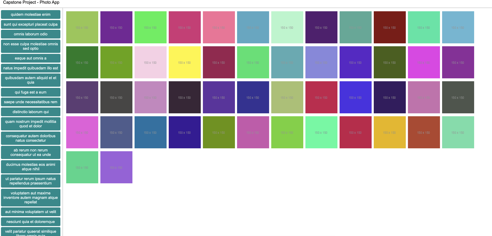

## Getting Started

```
yarn vite --config vite.config.js <project[Folder]Name>
```

Either clone master and `yarn install`, or start with `getting-started` and:

```sh
yarn add vue@3.0.7
yarn add vite@2.1.1 --dev
```

## Project: Capstone Project: Photo Album

Combine the Composition API, Vue Router and Vuex to build a large, complex application.

- combining everything
- slots
- design patterns
- vue/vuex/vue-router
- optimizing with caching in Vuex

## View


